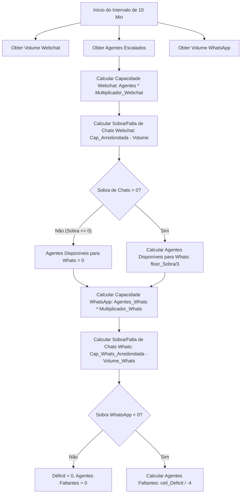
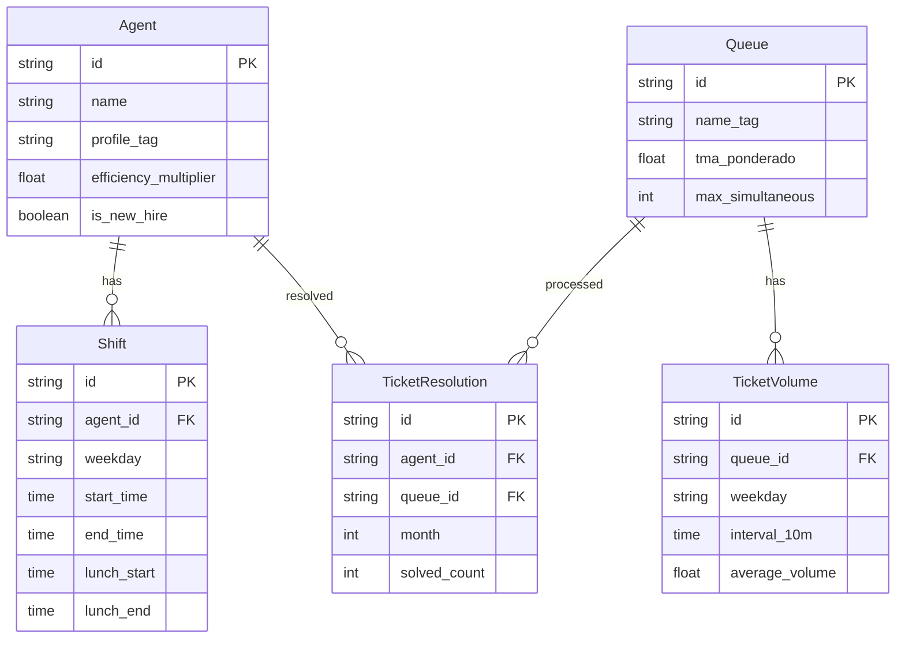

# Guia Técnico de Dimensionamento - Time de Care & Forecast de Suporte

> **Yooga — Planejamento Operacional e Inteligência de Atendimento**
> Versão: 1.0 (Maio/2026)

---

## 📋 1. Visão Geral e Contexto Operacional

O **Dimensionamento Care** é uma metodologia estruturada para calcular a escala ideal de agentes de suporte (atendimento ao cliente) na Yooga. O objetivo central é gerenciar o equilíbrio entre a carga de trabalho do time de suporte, a qualidade de atendimento (SLA) e a eficiência de custos com contratações, evitando a sobrecarga cognitiva dos agentes e garantindo um tempo mínimo de espera para os clientes.

O suporte funciona em regime estendido de atendimento de **07:00 às 03:00 (20 horas/dia)**. O dimensionamento de escalas baseia-se no volume histórico de chamados em janelas consecutivas de **10 minutos**, modelando a transição de canais prioritários e alocação dinâmica.

Este documento consolida a análise detalhada de dois arquivos fundamentais do projeto:

1. **`Cópia de Dimensionamento Care.xlsx`** (Planilha operacional contendo histórico de chamados, capacidade e simulações).
2. **`Dimensionamento - Care.pdf`** (Manual de regras de negócio, modelagem matemática de filas e premissas operacionais).

---

## 🏗️ 2. Arquitetura de Dados das Fontes de Informação

### 2.1 Estrutura do Arquivo de Planilha (`Cópia de Dimensionamento Care.xlsx`)

A planilha operacional é dividida em quatro abas principais:

1. **`Capacity p dia - Fevereiro26`**: Consolida dados individuais e diários da equipe. Mapeia a produtividade individual dos agentes (ex: Bruno Oliveira, Lucas Rocha, Felipe Gramlich, etc.) em chamados resolvidos por Trimestre, Mês, Dia, Hora, blocos de 20 min e 10 min.
2. **`Fevereiro-26-Webchat`**: Tabela principal de 141 linhas correspondendo a intervalos de 10 minutos (das 07:00 às 23:50). Calcula o volume médio real, capacidade nominal (agentes ativos \* produtividade unitária) e o surplus (sobra de chats), liberando os agentes excedentes para o WhatsApp.
3. **`Fevereiro-26-Whatsapp`**: Tabela correspondente para a fila de WhatsApp. Recebe a capacidade resultante dos agentes ociosos liberados pela fila de Webchat (prioritária), calcula a sobra ou déficit de chats do WhatsApp e determina a quantidade exata de agentes faltantes por bloco de 10 minutos.
4. **`Prova Real-Contratações-Feverei`**: Aba de simulação idêntica à de WhatsApp, projetando o impacto na escala futura ao adicionar novos agentes contratados (simulando a eliminação de déficits).

### 2.2 Estrutura do Documento PDF (`Dimensionamento - Care.pdf`)

O documento PDF de 43 páginas detalha o embasamento teórico e operacional do modelo de dimensionamento:

- **Páginas 1 a 5**: Introdução teórica, cálculo do _Capacity_ unitário diário baseado em históricos de 3 a 6 meses.
- **Páginas 6 a 11**: Modelagem matemática da relação entre TMA e capacidade simultânea (chats concomitantes), detalhando os limites práticos e equações das filas prioritárias (Webchat e WhatsApp).
- **Páginas 12 a 17**: Análise das defasagens horárias e especificação do **Agente de IA de Análise de Escala** (incluindo o prompt do sistema, regras trabalhistas da escala 5x2 e formatação JSON de output).
- **Páginas 18 a 21**: Validações de Prova Real, limitações do modelo atual e introdução de melhorias baseadas no **Modelo Erlang C**.
- **Páginas 22 a 25**: Lógica de **Segmentação de Filas por Tag** (Periféricos, Pagamentos, Fiscal & Dash, App) e **Alocação por Perfil** de agente.
- **Páginas 26 a 33**: Apresentação de fórmulas avançadas de TMA Ponderado, Volume Diário Corrigido e distribuição proporcional do time disponível (exemplo prático de alocação de 15 agentes).
- **Páginas 34 a 43**: Detalhamento das lacunas de transição, contingência de fila unificada (mínimo de 4 agentes) e estrutura contínua do prompt do analista.

---

## 🧮 3. A Metodologia de Cálculo de Dimensionamento

A Yooga adota um modelo de **Alocação Dinâmica Prioritária com Transbordamento Operacional (Overflow)**. O atendimento é dividido entre duas filas principais: **Webchat** (prioritário) e **WhatsApp** (secundário).



### 3.1 O Core da Lógica de Cálculo

1. **Prioridade Webchat**: Toda a força de trabalho ativa no momento é alocada primeiramente para cobrir a demanda de Webchat.
2. **Cálculo da Capacidade Webchat**: O volume limite que os agentes conseguem absorver no Webchat sem estourar o SLA.
3. **Overflow para WhatsApp**: Se a capacidade arredondada do Webchat for maior que o volume real de chamados, calcula-se o excedente. Cada agente ocioso pode atender **3 chats simultâneos** na fila de Webchat. Logo, a cada 3 chats de sobra, 1 agente integral é liberado para atuar no WhatsApp.
4. **Cálculo da Capacidade WhatsApp**: O grupo de agentes liberados é multiplicado pelo multiplicador de capacidade de WhatsApp.
5. **Déficit e Contratações**: Se a demanda de WhatsApp superar a capacidade dos agentes liberados, gera-se um déficit de chats. Sabendo que cada agente alocado exclusivamente no WhatsApp atende até **4 chats simultâneos**, o déficit de chats é dividido por 4 para apontar o número de agentes que precisam ser contratados para cobrir aquela faixa horária.

---

## 🔬 4. Fórmulas Matemáticas Detalhadas e Mapeamento do Excel

Abaixo estão detalhadas as equações matemáticas aplicadas célula a célula na planilha, utilizando a linha 3 (bloco correspondente a **07:10:00**) como referência de referência para mapeamento.

### 4.1 Aba `Fevereiro-26-Webchat`

#### A. Capacidade Raw (Fator de Capacidade Diário por Agente)

Representa a capacidade unitária de um agente no Webchat em um bloco de 10 minutos. É um valor hardcoded por dia da semana baseado no TMA específico histórico daquele dia:
$$\text{Capacidade Unitária Webchat} = \frac{10 \text{ min}}{\text{TMA específico do dia (min)}} \times 3 \text{ (simultâneos)}$$

- _Valores da Planilha (Col K a Q em Row 3)_:
  - **Segunda**: $1.63$ (TMA unitário $\approx 18.40$ min)
  - **Terça**: $1.67$ (TMA unitário $\approx 17.96$ min)
  - **Quarta**: $2.70$ (TMA unitário $\approx 11.11$ min)
  - **Quinta / Sexta**: $1.33$ (TMA unitário $\approx 22.56$ min)
  - **Sábado**: $1.64$ (TMA unitário $\approx 18.29$ min)
  - **Domingo**: $1.76$ (TMA unitário $\approx 17.05$ min)

#### B. Capacidade Webchat Bruta (Col K a Q)

Calculada multiplicando o número de agentes ativos no bloco de tempo pela capacidade unitária do dia.
$$\text{Capacidade Bruta}_{t} = \text{Agentes Ativos}_{t} \times \text{Capacidade Unitária Webchat}$$

- _Exemplo Segunda-feira (K3)_: $1.63$ (Equivale a 1 agente ativo, pois $1 \times 1.63 = 1.63$).

#### C. Capacidade Webchat Arredondada (Col S a Y)

A capacidade real disponível é o arredondamento para cima do valor bruto para garantir cobertura de números fracionários de agentes:
$$\text{S3} = \text{ROUNDUP(K3, 0)}$$

- _Exemplo Segunda-feira (S3)_: $\text{ROUNDUP}(1.63, 0) = 2.0$ chamados de capacidade.

#### D. Chats que Restam (Col AB a AH - Tabela de Excedentes)

_Nota de Arquitetura_: Esta tabela está localizada à direita da aba e possui um cabeçalho na linha 2. Portanto, a linha 3 calcula o resultado referente à linha 2 (bloco de 07:00:00).
$$\text{Chats Restantes (Surplus)}_{07:00:00} = \text{Capacity Arredondada} - \text{Volume Real}$$
$$\text{AB3 (Segunda)} = S2 - B2$$

- _Mapeamento_: $2.0 \text{ (S2)} - 0.076923 \text{ (B2)} = 1.923077$ chats de sobra.

#### E. Agentes Disponíveis para o WhatsApp (Col AJ a AP)

Calcula a quantidade de agentes inteiros equivalentes que podem ser movidos para a fila de WhatsApp a partir da sobra de chats no Webchat.
$$\text{Agentes WhatsApp}_{07:00:00} = \lfloor \frac{\text{Chats Restantes}}{3} \rfloor$$
$$\text{AJ3 (Segunda)} = \text{ROUNDDOWN(AB3 / 3, 0)}$$

- _Mapeamento_: $\text{ROUNDDOWN}(1.923077 / 3, 0) = 0$ agentes disponíveis (não houve sobra suficiente).

---

### 4.2 Aba `Fevereiro-26-Whatsapp`

#### A. Capacidade WhatsApp por Agente

Cada agente deslocado para o WhatsApp opera com um limite cognitivo aumentado de **4 chamados simultâneos** (conforme regras operacionais descritas no PDF, página 11):
$$\text{Capacidade Unitária Whats} = \text{Capacidade Unitária Webchat} \times \frac{4}{3}$$

- _Valores da Planilha (Col K a Q em Row 3)_:
  - **Segunda**: $2.17$ ($1.63 \times 1.3333$)
  - **Terça**: $2.23$ ($1.67 \times 1.3333$)
  - **Quarta**: $1.80$ ($1.35 \times 1.3333$)
  - **Quinta / Sexta**: $1.77$ ($1.33 \times 1.3333$)
  - **Sábado**: $2.18$ ($1.64 \times 1.3333$)
  - **Domingo**: $2.35$ ($1.76 \times 1.3333$)

#### B. Capacidade WhatsApp Disponível Bruta (Col K a Q)

Calcula a capacidade total na fila de WhatsApp a partir dos agentes deslocados obtidos da aba do Webchat:
$$\text{Capacidade Whats Bruta}_{t} = \text{Agentes WhatsApp (Aba Webchat)}_{t} \times \text{Capacidade Unitária Whats}$$

- _Exemplo Segunda-feira 08:00:00 (Row 8)_: $1 \text{ (Agente da aba Webchat Col AJ9)} \times 2.17 = 2.17$.

#### C. Capacidade WhatsApp Arredondada (Col S a Y)

$$\text{S8} = \text{ROUNDUP(K8, 0)}$$

- _Mapeamento_: $\text{ROUNDUP}(2.17, 0) = 3.0$ chamados de capacidade.

#### D. Resultado WhatsApp - Chats que Restam (Col AA a AG)

Calcula se o canal de WhatsApp teve sobra de chats (resultado positivo) ou déficit (resultado negativo):
$$\text{AA3 (Segunda 07:10:00)} = S3 - B3$$

- _Mapeamento_: $0 \text{ (S3 - Cap Arredondada)} - 0.076923 \text{ (B3 - Volume)} = -0.076923$ (Déficit).

#### E. Quantidade de Agentes que Faltam (Col AI a AO)

Se há déficit de chats (resultado negativo em AA3), calcula-se quantos agentes adicionais são necessários no WhatsApp (sabendo que cada agente novo contratado absorverá até 4 chamados simultâneos):
$$\text{Agentes Faltantes}_{07:10:00} = \lceil \frac{\text{Déficit Chats}}{-4} \rceil$$
$$\text{AI3 (Segunda)} = \text{ROUNDUP(AA3 / -4, 0)}$$

- _Mapeamento_: $\text{ROUNDUP}(-0.076923 / -4, 0) = \text{ROUNDUP}(0.01923, 0) = 1$ agente faltante.

> [!NOTE]
> Se o resultado da diferença de chats for positivo (ex: $2.84$ em `AA8` às 08:00:00), a fórmula executará $\text{ROUNDUP}(2.84 / -4, 0) = \text{ROUNDUP}(-0.71, 0) = 0$ (ou número negativo, que indica excedente de agentes, sendo tratado logicamente como "zero déficit").

---

### 4.3 Aba `Prova Real-Contratações-Feverei`

Esta aba replica a estrutura de WhatsApp, mas altera os valores de capacidade ativa (Colunas K a Q) adicionando os agentes indicados pela simulação do analista de IA.

- **Exemplo**: Às 14:00:00 de segunda-feira na aba de WhatsApp normal, a capacidade arredondada era $5.0$ e havia déficit de agentes. Na **Prova Real**, com a contratação de novos agentes escalados nessa faixa horária, a capacidade arredondada sobe para $9.0$, reduzindo a coluna de Agentes Faltantes para zero.

---

## 📝 5. Regras de Escala 5x2 e Restrições de Negócio

Para que o novo aplicativo web organize e valide as escalas geradas (seja por um algoritmo otimizador ou pelo analista humano), ele deve respeitar estritamente o conjunto de regras trabalhistas e de governança vigentes na Yooga, descritas a seguir.

### 5.1 Restrições Governamentais e Operacionais

1. **Teto de Contratações por Turno**:
   - O número máximo total de agentes na equipe de suporte não deve passar de **6**.
   - O aplicativo web deve limitar o volume máximo de novas contratações mensais a **4 agentes**.
2. **Escala Trabalhista 5x2**:
   - Cada agente deve cumprir uma jornada diária de **8 horas de trabalho efetivo + 1 hora de almoço** (9 horas totais de permanência).
   - O agente trabalha **5 dias** e folga **2 dias** por semana.
   - Exemplo de objeto de escala:
     ```python
     "Agente_3": {
         "horario_entrada": "09:00",
         "horario_saida": "18:00",
         "dias_trabalhados": ["ter", "qua", "qui", "sex", "sáb"],
         "dias_folga": ["seg", "dom"]
     }
     ```

### 5.2 Regras de Folgas e Fim de Semana (Crítico)

Para manter a saúde operacional e o bem-estar da equipe, o modelo Yooga impõe regras complexas sobre o revezamento de finais de semana:

1. **Janela Restrita de Folgas**: As duas folgas semanais de cada agente devem ocorrer obrigatoriamente dentro do intervalo de **Sábado a Terça-feira** (Sábado, Domingo, Segunda ou Terça).
2. **Proibição de Folgas Fim de Semana Consecutivas**: Um agente **nunca** pode ter Sábado e Domingo de folga na mesma semana.
3. **Padrões de Folga Permitidos**:
   - Sábado e Segunda-feira
   - Domingo e Segunda-feira
   - Sábado e Terça-feira
   - Domingo e Terça-feira
4. **Proibição de Dias de Trabalho Fim de Semana Consecutivos**: Um agente **não pode trabalhar no sábado e no domingo seguidos**.
   - Se o agente trabalhar no **Sábado**, é obrigatório folgar no **Domingo**.
   - Se o agente trabalhar no **Domingo**, é obrigatório folgar no **Sábado**.

### 5.3 Lógica de Equilíbrio das Contratações

- **Priorização**: As contratações propostas devem ser ordenadas por ordem de impacto. O "Agente 1" deve cobrir a faixa de maior gargalo/déficit acumulado da semana.
- **Balanceamento Operacional**: É operacionalmente melhor manter todos os dias da semana com déficits mínimos e controlados (ex: máximo de 1 agente faltante em faixas esparsas) do que superdimensionar um dia da semana (ex: segunda-feira perfeita com folga extrema de agentes) e deixar outros dias da semana com gargalos severos de atendimento.

---

## 👥 6. Lógica de Segmentação por Tag e Perfis de Agente

O estudo avançado nas páginas 22 a 25 do PDF propõe a evolução operacional do time de suporte, migrando de uma fila "unificada" (onde todos os agentes atendem qualquer tipo de chamado) para uma **Escala Especializada Segmentada**.

### 6.1 Os 4 Segmentos de Filas (Tags)

O suporte foi organizado em 4 frentes temáticas que otimizam o tempo de resolução devido à similaridade cognitiva e especialização dos atendentes:

| Segmento          | Temas / Tags Cobertos                                                    | TMA Ponderado Histórico | Capacidade Simultânea (SLA)         | Capacidade Diária (8h)               |
| :---------------- | :----------------------------------------------------------------------- | :---------------------- | :---------------------------------- | :----------------------------------- |
| **Periféricos**   | Impressões, Balanças, Leitores, KDS, Garçom Digital                      | $35,65 \text{ min}$     | $3$ chamados                        | $\approx 40,74 \text{ chamados/dia}$ |
| **Fiscal & Dash** | Dashboard Geral, Fiscal Geral                                            | $26,21 \text{ min}$     | $4$ chamados (arredondado de $3.3$) | $\approx 73,24 \text{ chamados/dia}$ |
| **Pagamentos**    | Financeiro, Integrações MP x Stone, Pix, Crédito Online, Planos x Upsell | $24,49 \text{ min}$     | $4$ chamados (arredondado de $3.5$) | $\approx 78,39 \text{ chamados/dia}$ |
| **App**           | Delivery, PDV, Usabilidade e solicitações gerais do aplicativo           | $34,97 \text{ min}$     | $3$ chamados (arredondado de $2.5$) | $\approx 41,17 \text{ chamados/dia}$ |

- **Referência Base**: A métrica de referência histórica para a fila Geral unificada é de **3 simultâneos para um TMA Geral de 28,86 min** ($\approx 49,89$ atendimentos/dia por agente).

### 6.2 Regra Limiar de Segmentação (Fallback para Fila Unificada)

A segmentação em filas tem uma restrição operacional séria: **exige no mínimo 4 agentes logados e ativos no suporte ao mesmo tempo** (um para cada fila).

- Se a escala em determinado horário (ex: início da manhã ou madrugada) possuir **menos de 4 agentes ativos**, a segmentação por tags é **desativada automaticamente** e os agentes retornam à **5ª Fila (Fila Unificada Geral)** para evitar que algum canal fique com zero atendentes (clientes no vácuo).

### 6.3 Distribuição por Perfil de Expertise

Baseado no mapeamento do time histórico da Yooga, a distribuição recomendada por afinidade técnica e capacidade é:

- **Periféricos (4 Agentes)**: Daniboy, Bruno Oliveira, Lucas Duarte, Julio Cesar.
- **Pagamentos (4 Agentes)**: Wagner, Herick, Leandro, Lucas Rocha.
- **Fiscal & Dash (2 Agentes)**: Filipe, Saraiva.
- **App (6 Agentes)**: Karen, Sofia Luany, Romério, Marlon Sá, Wardney, Caio.

---

## 🛠️ 7. Proposta de Arquitetura para o Novo Aplicativo Web

Para que os próximos agentes de IA criem uma aplicação web robusta, modular e altamente premium (seguindo as diretrizes visuais do manual `GEMINI.md` de Wow Factor e harmonia de cores HSL, sem utilizar violeta/roxo puro), propõe-se a seguinte especificação técnica.

### 7.1 Tech Stack Recomendada

- **Frontend**: React.js (com TypeScript e Vite) configurado no diretório `./` para respostas SPA extremamente rápidas.
- **Estilização**: Vanilla CSS customizado com variáveis CSS para criar um visual escuro moderno (Dark Mode premium, com glassmorphism nos cards de escala e microanimações interativas).
- **Componentes**: Shadcn/ui para inputs de horários, seletores de folga e dashboards de gráficos de defasagem (utilizando Recharts para plotar o volume e déficit em tempo real).
- **Backend**: Endpoints de API implementados via Server Actions (caso migre para Next.js) ou uma API Node.js/Vite integrada que processe os cálculos matemáticos descritos na Seção 4.

### 7.2 Diagrama de Entidades do Banco de Dados (Sugestão de Modelagem)



### 7.3 APIs Essenciais para Desenvolvimento do App

#### 1. `POST /api/dimensionamento/calcular`

- **Objetivo**: Processar os volumes históricos em CSV/JSON e retornar a planilha calculada minuto a minuto.
- **Input**:
  ```json
  {
    "volume_webchat": [{ "time": "08:00", "seg": 0.23, "ter": 0.54, "qua": 0.61 }],
    "volume_whatsapp": [{ "time": "08:00", "seg": 0.15, "ter": 0.15, "qua": 0.46 }],
    "escala_ativa": [{ "time": "08:00", "seg": 2, "ter": 2, "qua": 3 }] // Qtd de agentes por dia/hora
  }
  ```
- **Output**:
  ```json
  {
    "calculos": [
      {
        "time": "08:00",
        "dia": "seg",
        "webchat": {
          "volume": 0.23,
          "capacity_raw": 3.26,
          "capacity_arredondada": 4.0,
          "chats_restantes": 3.77,
          "agentes_whatsapp": 1
        },
        "whatsapp": {
          "volume": 0.15,
          "capacity_raw": 2.17,
          "capacity_arredondada": 3.0,
          "chats_restantes": 2.85,
          "agentes_faltantes": 0
        }
      }
    ]
  }
  ```

#### 2. `POST /api/escala/validar`

- **Objetivo**: Validar se uma proposta de escala do time atende perfeitamente a todas as restrições da escala 5x2 e folgas trabalhistas (Seção 5).
- **Input**: Um objeto com o mapeamento de todos os agentes e suas jornadas semanais.
- **Output**:
  ```json
  {
    "valido": false,
    "erros": [
      "Agente_3 possui folga consecutiva no sábado e domingo.",
      "Agente_1 trabalha sábado e domingo consecutivos sem folga intermediária."
    ]
  }
  ```

#### 3. `POST /api/escala/otimizar`

- **Objetivo**: O motor algoritmo (Engine de Otimização) que lê o déficit de faixas de 10 minutos obtido do cálculo de WhatsApp e gera automaticamente as melhores 4 escalas de contratação (Agent objects) otimizando para o menor déficit total acumulado.

---

> Guia técnico elaborado com base no processamento exato e auditoria de fórmulas do ecossistema de dimensionamento da Yooga. Esta documentação servirá como a única especificação confiável para orientação de novos agentes de inteligência artificial ou desenvolvedores focados em arquitetar o novo software.
